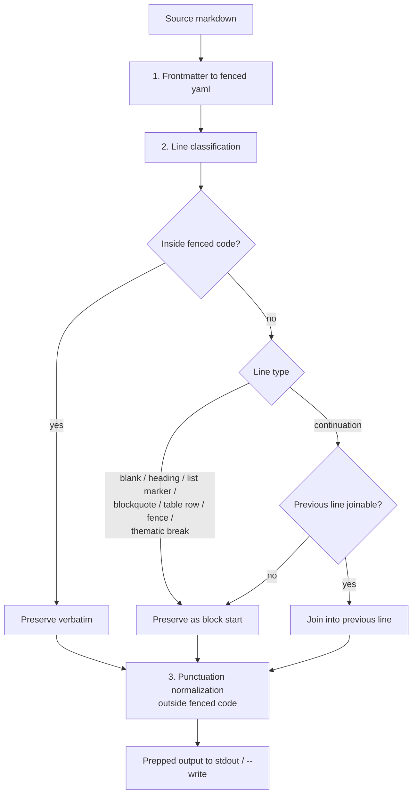
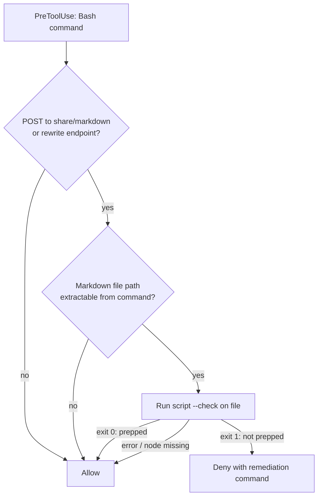

# Prep-for-Proof Preprocessing Skill - Plan

## Goal Capsule

- **Objective:** Ship a deterministic `prep-for-proof` preprocessing step in the bcal-workflow plugin — a zero-dependency Node script, a skill wrapping it, a PreToolUse enforcement hook, and instruction wiring — so markdown bound for Proof (proofeditor.ai) stops shipping broken.
- **Authority:** This plan's Product Contract and KTDs govern; repo conventions in `CLAUDE.md` (simplicity-first, surgical changes) govern anything the plan leaves open; the bcal-brain lesson `vault/lessons/lesson-2026-06-05-preprocess-markdown-before-uploading-to-proof-frontmatter-un.md` is the authoritative transform spec.
- **Execution profile:** Test-first for the transform script; smoke verification for hook and wiring. All new code runs on Node stdlib only.
- **Stop conditions:** Stop and surface if Proof upload command shapes are found that the hook design cannot classify (beyond the fail-open path), or if reconciling the existing frontmatter guidance would change behavior in downstream repos beyond wording.
- **Tail ownership:** Implementer verifies via the Verification Contract; release (marketplace publish, `/plugins` update) stays with the user.

---

## Product Contract

### Summary

Add a `prep-for-proof` skill to this plugin: a single-file Node script implementing three transforms (frontmatter to fenced yaml, unicode punctuation to ASCII, block-safe paragraph unwrapping) with a fixpoint `--check` mode, `node:test` coverage, a Claude Code PreToolUse hook that blocks un-prepped Proof uploads, and prep-requirement wiring into this repo's Proof guidance plus a paste-able practice snippet for other repos.

### Problem Frame

Markdown uploaded to Proof repeatedly ships broken in the same three ways: hard-wrapped paragraphs render as choppy short lines (Proof treats a single newline as a hard break), non-ASCII punctuation renders as replacement characters, and raw YAML frontmatter delimiters garble. Each failure reads to reviewers as "the document is broken" and derails content review. The failure recurred twice on the same upload helper, so the fix must be a deterministic, reusable step every Proof-bound path uses — not a per-incident patch. The transforms and a safe unwrap heuristic are already specified in the bcal-brain lesson; this plan productizes them in the plugin all Blue Collar AI Labs repos consume.

### Requirements

**Transform script**

- R1. The script converts a leading YAML frontmatter block into a fenced `yaml` code block, preserving the metadata visibly (never silently stripping it). `---` used later in the document as a thematic break is untouched.
- R2. The script normalizes non-ASCII punctuation to ASCII per a single canonical mapping (em/en dashes, smart single/double quotes, ellipsis, arrows), leaving fenced code block content untouched.
- R3. The script unwraps intra-paragraph soft line breaks per the lesson's heuristic: join continuation lines (non-blank, not starting a block marker) into the previous joinable line; preserve blank lines, headings, list markers, blockquotes, table rows, thematic breaks, and all fenced-code content; never join a continuation into a heading, fence, thematic break, table row, or blockquote.
- R4. The script is idempotent — `prep(prep(x)) === prep(x)` — and exposes a `--check` mode defining "prepped" as fixpoint: exit 0 iff `prep(content) === content`, exit 1 otherwise. Detection and idempotency are the same property.
- R5. The script is a single file on Node stdlib (zero dependencies), reads a file argument, writes the transformed result to stdout by default with an optional `--write <out>` flag, and never mutates the source file in place.
- R6. Unit tests via `node:test` cover each transform, block-safety (fenced code, tables, lists, blockquotes), CRLF input, the fixpoint invariant, `--check` exit codes, and a hard-wrapped unicode-heavy fixture with frontmatter whose prepped output is asserted byte-exact.

**Skill and enforcement**

- R7. A `prep-for-proof` skill (SKILL.md + `agents/openai.yaml`) documents the canonical output format in one place, gives literal per-shell invocations (Bash and PowerShell), and includes a pre-flight Node availability check in the repo's error-block-then-stop style.
- R8. A PreToolUse hook shipped in the plugin denies Bash commands that upload markdown to Proof write endpoints (`POST /share/markdown`, `POST .../rewrite`) when the referenced markdown fails `--check`; the denial message contains the exact remediation command with the real file path. Read-only Proof calls, ops/marks calls, and commands merely embedding a Proof URL (e.g. `notify-proof` Slack payloads) pass. Any hook-internal error (missing node, unparseable command, no extractable file) fails open.

**Wiring and release**

- R9. This repo's Proof guidance requires the prep step: `CLAUDE.md` Proof Integration section updated, `notify-proof` gains a prep precondition, the existing `proof-frontmatter` practice is reconciled (fenced yaml block becomes the approved way to "include" frontmatter), and a new `prep-for-proof` practice carries the paste-able CLAUDE.md snippet for other repos.
- R10. Both plugin manifests are bumped (`0.9.3 → 0.9.4`, `0.5.2 → 0.5.3`), the Codex manifest's `interface.longDescription` prose mentions Proof prep, README skill lists gain a `prep-for-proof` row, and the README documents the test invocation (`node --test skills/prep-for-proof/scripts/ hooks/scripts/`).

### Acceptance Examples

- AE1. **Round-trip fixture.** Given a hard-wrapped, unicode-heavy markdown file with YAML frontmatter containing a fenced code block, a table, a nested list, and a blockquote — when prepped — the output has frontmatter as a fenced yaml block, one logical line per paragraph, ASCII-only punctuation outside code, and untouched code/table/list/blockquote structure; prepping the output again is a byte-identical no-op.
- AE2. **Hook blocks and remediates.** Given a Bash command POSTing an un-prepped file's content to `/share/markdown` — when the hook fires — the call is denied with a message containing `node <plugin path>/… <file>`; after running that command and uploading the prepped output, the same upload passes.
- AE3. **Hook lets reads pass.** Given `end-session-gracefully`'s `GET https://www.proofeditor.ai/api/agent/{slug}/state` call, or a `notify-proof` Slack post whose payload embeds a Proof URL — the hook allows both without firing.

### Scope Boundaries

- The script transforms; it never uploads. Upload remains owned by other skills/plugins (`ce-proof`, proposal-pro).
- The hook is block-and-remind only — it never rewrites the command or the file, and it ships for Claude Code only (no hook mechanism exists for Codex/Gemini; SKILL.md instructions are the parity story there).
- No config surface beyond `--check` / `--write`; no npm packaging; no new dependencies.
- `notify-proof`'s own Slack-payload sanitization table stays as-is (different transport purpose); it gains only the prep precondition line.

**Deferred to Follow-Up Work**

- README staleness beyond the new row: missing `notify-pdf` and `apply-claude-md-best-practices` entries, and the notify-proof setup section names `SLACK_PROOF_WEBHOOK_URL` while the skill uses `SLACK_BOT_TOKEN` + `SLACK_REVIEW_CHANNEL_ID`.
- `docs/solutions/plugin-version-bump-update-detection-2026-05-04.md` describes a version-bump pre-commit guard that no longer exists in `.claude/settings.json` — the doc needs a refresh (manifest bumps in this change are manual).
- Gating `POST .../edit/v2` block edits: those are mid-review inline edits, not document uploads; out of scope for the hook.

---

## Planning Contract

### Key Technical Decisions

- **Canonical format contract, defined once.** The prepped-output format (fenced-yaml shape, punctuation mapping table, unwrap rules with excluded block types) lives in one section of the new SKILL.md; the script, its tests, and the hook derive from it. Rationale: `docs/solutions/conventions/cross-repo-file-canonical-format-contract-2026-05-14.md` — distributed restatements of a format drift; this output is consumed by Proof, the hook, and other repos.
- **Node stdlib runtime, `node:test`.** Node is present wherever npm-installed agent CLIs run, avoiding a new runtime assumption and Windows `python`/`python3` naming issues. This is the repo's first executable code; nothing runs tests automatically, so the invocation is documented in SKILL.md and the Verification Contract.
- **Stdout default, `--write <out>` optional, never in-place.** The source file stays canonical: other pipelines (glow-up `render`, proposal-pro) parse real YAML frontmatter, and in-place conversion to a fenced block would break them. The prepped artifact is what gets uploaded — the checked path and the uploaded path must be the same path.
- **Prepped = fixpoint.** `--check` (exit 0 iff `prep(content) === content`) is the single detection primitive shared by agents on any platform and by the hook. No marker comments or sidecar state, which drift from content after edits.
- **Instructions are primary enforcement; the hook is Claude Code defense-in-depth.** Codex and Gemini get zero hook coverage, so SKILL.md/CLAUDE.md wiring must be sufficient alone, phrased as a hard precondition. The hook exists because agents forget instructions.
- **Hook gating: tool-name matcher + in-script content filter, fail open.** The hooks.json `matcher` can only match tool names (`Bash`); the hook script filters for POSTs to the two write endpoints, extracts a markdown file path from the command (`-d @file`, `< file`, `jq … file |` shapes), and runs `--check` on it. No extractable path, missing node, or any internal error → allow. Rationale: a fail-closed hook that can't parse a heredoc upload hard-blocks legitimate work with no recovery; hook crashes already default to allow in Claude Code.
- **Punctuation mapping follows the bcal-brain lesson** (`--`, `-`, `'`, `"`, `...`, `->`), cross-checked against `notify-proof`'s existing replacement table; any divergence (e.g. spacing around `--`, arrows having no repo precedent) is stated in the canonical contract rather than left implicit.
- **Existing `proof-frontmatter` practice updated in place, not superseded.** Its "do not strip frontmatter" intent is preserved — the fenced yaml block becomes the approved mechanism — so downstream CLAUDE.md files carrying the old snippet get a compatible, not contradictory, successor.

### High-Level Technical Design

Transform pipeline and line-classifier (the unwrap step is the subtle one — R3):



Hook decision flow (R8):



Diagrams are directional; the prose Requirements and KTDs are authoritative.

### Assumptions

- Proof uploads from this machine's plugins arrive as Bash `curl` calls (verified in `ce-proof` and consistent with proposal-pro); MCP-tool-based uploads, if they appear later, would need a matcher extension (deferred).
- `${CLAUDE_PLUGIN_ROOT}` (hooks) and `${CLAUDE_SKILL_DIR}` (skills, Claude Code v2.1.196+) resolve as documented; the hook command is quoted for paths with spaces.

### Sources & Research

- Transform spec: bcal-brain `vault/lessons/lesson-2026-06-05-preprocess-markdown-before-uploading-to-proof-frontmatter-un.md` (authoritative unwrap heuristic and mapping).
- Upload wire shape: `ce-proof` SKILL.md — `POST https://www.proofeditor.ai/share/markdown`, whole-doc `POST .../rewrite`; read path `GET .../api/agent/{slug}/state` (also used by `skills/end-session-gracefully/SKILL.md` step 5).
- Hook mechanics: Claude Code docs — plugins ship `hooks/hooks.json`; `matcher` is tool-name-only; deny via `hookSpecificOutput.permissionDecision: "deny"` with `permissionDecisionReason`; hook errors default to allow.
- Repo conventions: two-field SKILL.md frontmatter, `## Steps` with error-block-then-stop pre-flights, per-shell command convention (`docs/solutions/conventions/shell-specific-env-var-commands-2026-05-14.md`), practice-file schema (`name`/`category`/`detect` + What/Why/Snippet).

---

## Risks & Dependencies

- **Hook coverage depends on other plugins' command shapes.** Uploads are emitted by `ce-proof` and proposal-pro, which this repo does not control; if their upload commands change shape (different flag style, MCP tool instead of Bash), the hook silently stops firing via the fail-open path. Mitigation: instructions remain the primary enforcement (KTD5), the hook's tests pin the known shapes so drift is visible when they're revisited, and MCP-shaped uploads are an explicit deferred extension.
- **Every marketplace consumer inherits an executable hook on every Bash call.** This is a new trust and latency surface: a Node process spawns per Bash tool call. Mitigation: the gate script's first action is a cheap string test on the command with immediate silent exit for non-Proof calls (no file IO); the matcher stays `Bash`-only so no other tools are touched; the block-and-remind ceiling (never rewriting commands or files) is stated in SKILL.md and in the gate script's header comment (hooks.json is strict JSON and cannot carry comments).
- **Downstream repos already carry the old frontmatter snippet.** CLAUDE.md files that pasted the original `proof-frontmatter` snippet will hold old and new guidance simultaneously until re-applied. Mitigation: the new snippet is written as a compatible superset of the old intent (frontmatter still visible, now via fenced yaml), so coexistence degrades to redundancy, not contradiction; the practice `detect` regexes let `apply-claude-md-best-practices` flag repos needing the update.
- **Proof's renderer is an external moving target.** The transforms encode Proof behavior as observed in the 2026-06 lesson; Proof could change (e.g., start reflowing single newlines). Mitigation: the canonical contract is single-sourced and the AE1 fixture makes re-verification against live Proof a five-minute check.
- **Version dependency:** `${CLAUDE_SKILL_DIR}` in SKILL.md instructions requires Claude Code v2.1.196+; `${CLAUDE_PLUGIN_ROOT}` in hooks is long-standing. Mitigation: SKILL.md also states the plugin-relative path in prose so older harnesses and non-Claude agents can resolve the script.

---

## Output Structure

```
skills/prep-for-proof/
├── SKILL.md                          # canonical format contract + steps
├── agents/
│   └── openai.yaml                   # Codex interface block
└── scripts/
    ├── prep-for-proof.mjs            # the transform script
    ├── prep-for-proof.test.mjs       # node:test suite
    └── fixtures/
        ├── hard-wrapped-unicode.md   # master fixture (frontmatter, unicode, wraps, all block types)
        └── hard-wrapped-unicode.prepped.md
hooks/
├── hooks.json                        # PreToolUse registration
└── scripts/
    ├── proof-upload-gate.mjs         # hook script (stdin JSON in, decision JSON out)
    └── proof-upload-gate.test.mjs
```

Tree is a scope declaration; per-unit Files lists are authoritative.

---

## Implementation Units

### U1. Transform script and test suite

- **Goal:** The deterministic three-transform script with fixpoint `--check`, fully tested.
- **Requirements:** R1-R6
- **Dependencies:** none
- **Files:** `skills/prep-for-proof/scripts/prep-for-proof.mjs`, `skills/prep-for-proof/scripts/prep-for-proof.test.mjs`, `skills/prep-for-proof/scripts/fixtures/hard-wrapped-unicode.md`, `skills/prep-for-proof/scripts/fixtures/hard-wrapped-unicode.prepped.md`
- **Approach:** Single ESM file, stdlib only. Pipeline: frontmatter conversion → line-classified unwrap (tracking fenced-code state) → punctuation normalization outside fences. CLI: `node prep-for-proof.mjs <file>` (stdout), `--write <out>`, `--check`. Exit codes: 0 success/prepped, 1 `--check` failed, 2 usage/IO error.
- **Execution note:** Test-first — encode the canonical contract as failing tests (including the AE1 fixture), then implement until green.
- **Patterns to follow:** Transform rules verbatim from the bcal-brain lesson; punctuation mappings cross-checked with `skills/notify-proof/SKILL.md` step 3's table.
- **Test scenarios:**
  - Frontmatter: leading `---` block becomes fenced yaml with identical inner content; document without frontmatter unchanged; document that is only frontmatter; later `---` thematic break untouched.
  - Punctuation: each mapped character converts (em/en dash, curly single/double quotes, ellipsis, `→`); characters inside fenced code blocks untouched; CRLF input handled without corrupting line classification.
  - Unwrap: hard-wrapped paragraph joins to one logical line; blank lines preserved; wrapped list-item continuation joins into the item; table rows, blockquote lines, headings, thematic breaks never joined or receive joins; fenced code content byte-preserved.
  - Fixpoint (covers AE1): `prep(prep(x)) === prep(x)` for every fixture; `--check` exits 1 on the raw fixture and 0 on the prepped fixture; prepped fixture re-prepped is byte-identical.
  - CLI: `--write` writes the output file and leaves the source unmodified; missing file argument exits 2.
- **Verification:** `node --test skills/prep-for-proof/scripts/` passes; AE1 fixture output matches the committed `.prepped.md` byte-exact.

### U2. prep-for-proof skill definition

- **Goal:** The agent-facing skill: canonical format contract, invocation steps, Codex interface.
- **Requirements:** R7
- **Dependencies:** U1
- **Files:** `skills/prep-for-proof/SKILL.md`, `skills/prep-for-proof/agents/openai.yaml`
- **Approach:** Two-field frontmatter (`name`, `description`) matching repo convention. Body: purpose paragraph; a `## Canonical Output Format` section (the single format definition per KTD1 — fenced-yaml shape, mapping table, unwrap rules and excluded blocks); `## Steps` with a step-1 pre-flight (`node --version` check with exact error block, "Then stop — do not proceed"), then transform/check/upload-handoff steps giving literal Bash and PowerShell invocations via `${CLAUDE_SKILL_DIR}`. States plainly that the hook is Claude Code-only defense-in-depth.
- **Patterns to follow:** `skills/live-transcript/SKILL.md` (pre-flight style), `skills/write-to-diary/SKILL.md` (canonical-format section precedent), `agents/openai.yaml` shape from `skills/write-to-diary/agents/openai.yaml`.
- **Test scenarios:** Test expectation: none — instruction document; behavior is proven by U1's suite and the Verification Contract's end-to-end check.
- **Verification:** Skill loads under the plugin prefix after `/reload-plugins`; following its steps on the AE1 fixture produces the committed prepped output.

### U3. PreToolUse enforcement hook

- **Goal:** Claude Code blocks un-prepped Proof uploads with a self-remediating message.
- **Requirements:** R8
- **Dependencies:** U1 (`--check`)
- **Files:** `hooks/hooks.json`, `hooks/scripts/proof-upload-gate.mjs`, `hooks/scripts/proof-upload-gate.test.mjs`
- **Approach:** `hooks.json` registers PreToolUse with `matcher: "Bash"` and command `node "${CLAUDE_PLUGIN_ROOT}/hooks/scripts/proof-upload-gate.mjs"`. The script reads stdin JSON, applies the KTD6 decision flow, and on deny emits `permissionDecision: "deny"` with a reason containing the literal remediation command (real file path substituted). Everything else: exit 0, no output (allow). File-path extraction covers the known upload shapes (`-d @file`, stdin redirect, `jq -Rs . file |` pipe); unknown shapes fail open.
- **Test scenarios:**
  - Un-prepped upload (covers AE2): stdin JSON with a `curl -X POST …/share/markdown` command referencing the raw fixture → deny JSON whose reason contains `prep-for-proof.mjs` and the fixture path.
  - Prepped upload (covers AE2): same command referencing the prepped fixture → allow.
  - Read-only pass (covers AE3): `GET …/api/agent/x/state` command → allow, no output.
  - Embedded-URL pass (covers AE3): Slack `chat.postMessage` curl whose payload contains a proofeditor.ai URL → allow.
  - Fail-open: malformed stdin JSON → allow; command matching an endpoint but with no extractable file → allow; `--check` subprocess error → allow.
  - Rewrite endpoint: `POST …/rewrite` with un-prepped file → deny.
- **Verification:** `node --test hooks/scripts/` passes; manual smoke via `claude --debug` shows the hook firing on a simulated upload and staying silent for `end-session-gracefully`'s state read.

### U4. Guidance wiring and practice reconciliation

- **Goal:** Every instruction surface points at the prep step, with no contradictory frontmatter guidance.
- **Requirements:** R9
- **Dependencies:** U2
- **Files:** `CLAUDE.md`, `skills/notify-proof/SKILL.md`, `skills/apply-claude-md-best-practices/practices/proof-frontmatter.md`, `skills/apply-claude-md-best-practices/practices/prep-for-proof.md` (new)
- **Approach:** CLAUDE.md Proof Integration section gains the requirement: write one logical line per paragraph for Proof/email-bound prose; run prep-for-proof before upload; frontmatter is preserved as a fenced yaml block. `notify-proof` gains one precondition line (verify the posted document was prepped) — no other changes (surgical). `proof-frontmatter.md` practice is updated in place so "include frontmatter" means "as the fenced yaml block prep-for-proof produces." New practice file follows the `name`/`category: tooling`/`detect` schema with a `detect` regex anchored on `prep-for-proof` (no collision with `proof-frontmatter`'s regex) and carries the paste-able snippet — this is deliverable (c), distributable to other repos via the practice skill or direct paste.
- **Patterns to follow:** `skills/apply-claude-md-best-practices/practices/proof-frontmatter.md` (schema and ASCII-only snippet style).
- **Test scenarios:** Test expectation: none — instruction/documentation changes; consistency is checked in verification.
- **Verification:** Grep confirms no surface still says frontmatter is included raw; the two practice `detect` regexes don't match each other's snippets; new snippet is ASCII-only.

### U5. Release metadata

- **Goal:** The plugin update is detectable and documented.
- **Requirements:** R10
- **Dependencies:** U1-U4
- **Files:** `.claude-plugin/plugin.json`, `.codex-plugin/plugin.json`, `README.md`
- **Approach:** Bump `0.9.3 → 0.9.4` and `0.5.2 → 0.5.3`; extend the Codex `interface.longDescription` prose to mention Proof prep; add a `prep-for-proof` row to both README skill lists and a short section documenting `node --test skills/prep-for-proof/scripts/ hooks/scripts/` as the repo's test invocation (first executable code — nothing else documents it). Bumps are manual: the pre-commit guard described in docs/solutions no longer exists.
- **Test scenarios:** Test expectation: none — metadata/documentation.
- **Verification:** Both manifests parse as JSON with the new versions; README rows render.

---

## Verification Contract

| Check | Command / method | Proves |
|---|---|---|
| Unit tests | `node --test skills/prep-for-proof/scripts/ hooks/scripts/` | R1-R6, R8 script logic, AE1-AE3 at unit level |
| Fixture round-trip | covered in suite: raw fixture → prepped fixture byte-exact; prepped is a `--check` fixpoint | the stated "done means" criterion |
| Source untouched | covered in suite: `--write` leaves input file byte-identical | KTD3 (other consumers keep real frontmatter) |
| Hook smoke | `claude --debug`: simulate an un-prepped upload command and a state-read command | R8 end-to-end in the real harness |
| Plugin load | `/reload-plugins`, then invoke `bcal-workflow:prep-for-proof` (plugin-prefixed — stale `~/.claude/skills/` copies would mask it) | R7, orphan-copy lesson |
| Guidance consistency | grep Proof-frontmatter wording across `CLAUDE.md` and `practices/` | R9 |

---

## Definition of Done

- `node --test` suite passes; AE1 fixture round-trips byte-exact and is a `--check` fixpoint.
- Hook unit scenarios pass and the `claude --debug` smoke shows deny-on-un-prepped, silence on reads.
- All five units' files exist/are edited per their Files lists; both manifests bumped; Codex `longDescription` updated.
- No contradictory frontmatter guidance remains across CLAUDE.md and the practice library.
- No abandoned experiments or dead code in the diff.
