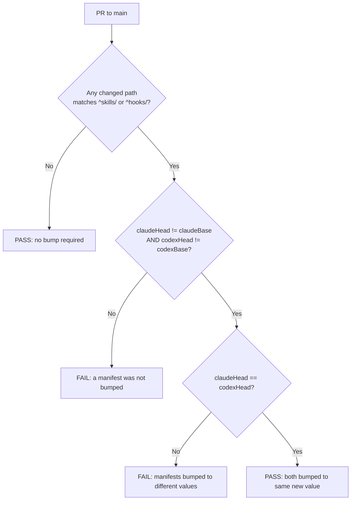
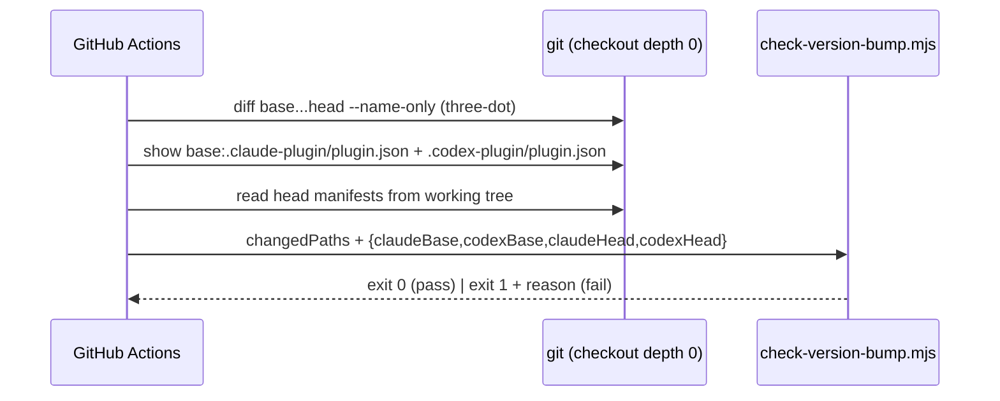

# feat: Enforce release discipline via unified version + CI manifest-bump guard

## Summary

Releases of this plugin are keyed off the manifest version string, so a source change that ships without a version bump reaches nobody — `/plugin update` sees the same version and offers nothing. Prose rules in `CLAUDE.md` did not prevent this (a structured code review missed them twice). This plan replaces prose with mechanical enforcement: **unify the two manifests onto one shared version**, add a **GitHub Actions check** that fails any PR to `main` that touches plugin source without bumping *both* manifests to the *same* new value, and **disable squash- and rebase-merge** so post-review commits can't be silently folded under an already-installed version.

**Product Contract preservation:** N/A — solo (bootstrap) plan, no upstream requirements doc.

---

## Problem Frame

Releases are detected purely by the `version` string in the two manifests (`.claude-plugin/plugin.json`, `.codex-plugin/plugin.json`). Two failure modes have shipped fixes that reached no one:

1. **Squash-merge** collapsed a branch (which included a version bump) onto `main` in a way that folded post-stamp commits under an already-installed version.
2. **A skipped re-bump** — a source change merged without touching the version at all.

Both are invisible to reviewers because the rule lived only in `CLAUDE.md` prose. The fix must be **mechanical and unavoidable through the GitHub UI**, not another written rule.

**Decision this plan commits to (user-selected):** the two manifests move from independent series (`0.9.x` for Claude Code, `0.5.x` for Codex) to **one shared version number**, bumped in lockstep to the *same* value on every release. This is a deliberate reversal of the current "each in its own series" convention and requires a one-time reconciliation plus updating every place that documents the old convention.

**Documentation note:** the prompt cited `docs/solutions/workflow-issues/no-squash-merge-versioned-plugin-release.md` and `docs/solutions/conventions/institutional-learnings-must-be-conventions-2026-05-27.md` as the source learnings. Neither file exists in this repo (verified — the word "squash" appears nowhere in the tree). This plan does **not** depend on them and does not create them; capturing the learning is deferred to a `ce-compound` run after this ships (see Deferred).

---

## Requirements

- **R1** — A PR to `main` that changes any file under `skills/` or `hooks/` without bumping **both** manifest versions fails CI.
- **R2** — "Bump" means both manifest `version` strings differ from their value on the base branch **and** equal each other (same new value).
- **R3** — A PR that touches only non-source files (docs, README, CLAUDE.md, CONCEPTS.md, DIARY.csv) passes regardless of version — no bump required.
- **R4** — Squash-merge and rebase-merge are impossible via the GitHub UI for this repo.
- **R5** — The two manifests are reconciled to a single shared starting version, and every place documenting the old dual-series convention is updated to match.
- **R6** — The check is proven to catch a deliberate violation on a scratch branch before this work is considered done.

**Traceability:** R1–R3 → U2, U3. R4 → U4. R5 → U1. R6 → U5.

---

## Scope Boundaries

**In scope:** manifest reconciliation to a unified version; convention rewrite across `CLAUDE.md`, the version-bump solution doc, and the local pre-commit hook; a Node checker script + tests; a GitHub Actions workflow; disabling squash/rebase merge; scratch-branch verification.

**Non-goals (this product's identity):**
- Semantic-version *correctness* (major/minor/patch judgment) — the check enforces *that* both bumped to the same new value, not *which* number is right.
- Auto-bumping versions for the author — the check reports; the human bumps.

### Deferred to Follow-Up Work
- Capturing this decision as a `docs/solutions/` learning via `ce-compound` (and recreating the two cited-but-missing docs if still wanted).
- Making the local `.git/hooks/pre-commit` guard require *both* manifests (it is machine-local and not version-controlled, so CI is the real gate — see U1 for the message-only update).
- Auto-installing the git hook on clone (a `scripts/install-hooks` shim).

---

## Key Technical Decisions

- **KTD1 — Unify to `1.0.0`.** Reconcile both manifests to `1.0.0`: it is ≥ both current maxes (`0.9.4`, `0.5.3`), is monotonic-forward for both update mechanisms, and cleanly signals the convention change. (Alternative — `0.9.5` — keeps the number small but makes Codex jump backward-feeling from a fresh 0.5.x mental model and buries the "we changed how we version" signal.)
- **KTD2 — Pure, testable checker; workflow gathers git data.** The rule lives in a Node stdlib script (`check-version-bump.mjs`) exposing a pure function over *(changed paths, base versions, head versions)*. The workflow does the git plumbing (diff, `git show` of base manifests) and passes values in. This matches the repo convention (Node stdlib + `node --test`) and makes the rule unit-testable with fixtures — no git or network in the tests.
- **KTD3 — Checker lives outside the trigger set.** Place the script and its test under `.github/scripts/`, not `skills/` or `hooks/`, so editing the checker itself doesn't demand a version bump (which would be circular).
- **KTD4 — Source trigger = `^(skills|hooks)/`.** Both directories ship user-facing plugin behavior per `CLAUDE.md` (skills logic; hook behavior). Anchored match so `docs/…`, `README.md`, and lookalikes such as `myskills/` never trigger.
- **KTD5 — Settings change is imperative, not committed.** Disabling squash/rebase merge is a `gh api` PATCH on repo settings, run once by an admin — it is not a file in the repo. The plan documents the exact call; execution runs it.
- **KTD6 — Failing CI vs. blocked merge.** The stated DoD is "fails CI." To make a red check actually *prevent* merge, it must be a **required status check** (branch protection / ruleset on `main`). U4 includes this as the recommended step that gives the check teeth; it is called out separately because it depends on the org's plan and admin rights.

---

## High-Level Technical Design

Guard decision flow (the pure function in `check-version-bump.mjs`):



Workflow responsibility vs. script responsibility:



Diagrams are authoritative alongside the prose; where they disagree, the prose governs.

---

## Output Structure

New files this plan creates (existing files modified in place are not shown):

```
.github/
├── workflows/
│   └── version-guard.yml          # PR-to-main check; gathers git data, invokes the checker
└── scripts/
    ├── check-version-bump.mjs     # pure rule: (changed paths, base/head versions) -> pass/fail
    └── check-version-bump.test.mjs
```

The per-unit `**Files:**` lists remain authoritative.

---

## Implementation Units

### U1. Adopt a unified manifest version and rewrite the convention

**Goal:** Move both manifests to one shared version (`1.0.0`) and update every place that documents the old dual-series rule, so the repo is never in a state where source says "same value" but docs say "own series."

**Requirements:** R5 (also unblocks R2 — after this lands, both base versions are identical).

**Dependencies:** none.

**Files:**
- `.claude-plugin/plugin.json` — set `version` to `1.0.0`
- `.codex-plugin/plugin.json` — set `version` to `1.0.0`
- `CLAUDE.md` — rewrite the manifest/versioning paragraph: both manifests share one version, bumped in lockstep to the same new value; remove "each in its own series" and the `0.9.x` / `0.5.x` split
- `docs/solutions/plugin-version-bump-update-detection-2026-05-04.md` — update Root Cause + Solution to describe the unified-version rule (this doc currently says "independent series" as of this session's earlier refresh)
- `.git/hooks/pre-commit` — update the error message to reference "both manifests to the same version" (logic stays; it is machine-local and CI is the real gate — see Deferred)

**Approach:** This is one atomic change: the version *state* and the prose *describing* it must land together. Pick `1.0.0` per KTD1. The pre-commit hook edit is message-only — do not try to make the shell hook enforce equality here; that is deferred.

**Patterns to follow:** existing manifest JSON shape (both files already carry `version`); the doc's existing Root Cause/Solution structure.

**Test scenarios:** `Test expectation: none — config/doc change with no runtime behavior.` Verification is that both manifests read `1.0.0` and no file still says "each in its own series" (grep for `0.9.x`, `0.5.x`, "own series").

**Verification:** `grep -rn "own series\|0\.9\.x\|0\.5\.x" CLAUDE.md docs/ .git/hooks/` returns nothing; both manifests show `1.0.0`.

---

### U2. Version-guard checker script and tests

**Goal:** A pure, unit-tested Node function that decides pass/fail from changed paths and the four version strings.

**Requirements:** R1, R2, R3.

**Dependencies:** U1 (so the "same value" invariant is coherent — both bases become `1.0.0`).

**Files:**
- `.github/scripts/check-version-bump.mjs` (create)
- `.github/scripts/check-version-bump.test.mjs` (create)
- `CLAUDE.md` — extend the test-command glob to include `.github/scripts/*.test.mjs`

**Approach:** Export a pure function, e.g. `evaluate({ changedPaths, claudeBase, codexBase, claudeHead, codexHead })` returning `{ ok, reason }`. Rule: `sourceTouched = changedPaths.some(p => /^(skills|hooks)\//.test(p))`; if not touched → ok. If touched → require `claudeHead !== claudeBase && codexHead !== codexBase && claudeHead === codexHead`. A thin CLI wrapper (executed only when run as main) reads inputs from argv/stdin and `process.exit(ok ? 0 : 1)` with the reason printed. Keep the function free of `git`/`fs`/network so tests use plain fixtures.

**Execution note:** Implement test-first — this is pure decision logic and the failure modes (R2's three ways to be invalid) are exactly what the tests pin down.

**Technical design (directional):**
```
evaluate({changedPaths, claudeBase, codexBase, claudeHead, codexHead}) -> {ok, reason}
  sourceTouched = changedPaths matches /^(skills|hooks)\//
  if !sourceTouched            -> {ok:true,  reason:"no source change"}
  if claudeHead==claudeBase ||
     codexHead==codexBase      -> {ok:false, reason:"manifest not bumped: <which>"}
  if claudeHead != codexHead   -> {ok:false, reason:"versions differ: <a> vs <b>"}
  else                         -> {ok:true,  reason:"both bumped to <v>"}
```

**Patterns to follow:** `hooks/scripts/proof-upload-gate.mjs` and its `*.test.mjs` (Node stdlib, `node --test`, exported pure core + main guard).

**Test scenarios:**
- Covers R1/R2. Source touched, both bumped to same new value (`1.0.0`→`1.0.1` both) → `ok:true`.
- Covers R1. Source touched, neither bumped → `ok:false`, reason names both.
- Covers R1. Source touched, only `.claude-plugin` bumped → `ok:false`, reason names codex.
- Covers R1. Source touched, only `.codex-plugin` bumped → `ok:false`, reason names claude.
- Covers R2. Source touched, both changed but to different values (`1.0.1` vs `1.0.2`) → `ok:false`, "versions differ".
- Covers R3. No source touched (only `README.md`, `docs/x.md`) with unchanged versions → `ok:true`.
- Edge — path anchoring: `myskills/x` and `docs/skills-note.md` do **not** count as source; `skills/a/SKILL.md` and `hooks/scripts/y.mjs` do.
- Edge — manifest-only change (versions bumped, no source touched) → `ok:true` (allowed).
- Edge — empty `changedPaths` → `ok:true`.

**Verification:** `node --test ".github/scripts/*.test.mjs"` passes; all nine scenarios green.

---

### U3. GitHub Actions workflow on PRs to main

**Goal:** Wire the checker into CI so it runs on every PR targeting `main` and gates on source changes.

**Requirements:** R1, R2, R3.

**Dependencies:** U2.

**Files:**
- `.github/workflows/version-guard.yml` (create)

**Approach:** Trigger `on: pull_request: branches: [main]`. Single job: `actions/checkout@v4` with `fetch-depth: 0`; compute changed paths with `git diff --name-only ${{ github.event.pull_request.base.sha }}...${{ github.sha }}`; read base manifests via `git show <base.sha>:<manifest>` and head manifests from the working tree; pass all five inputs to `check-version-bump.mjs`; the job fails when the script exits non-zero. Use the repo's system Node (`actions/setup-node@v4` pinned to a current LTS). Keep the workflow thin — all rule logic is in the script (KTD2).

**Patterns to follow:** none in-repo (first workflow); mirror the checker's input contract from U2 exactly.

**Test scenarios:** `Test expectation: none at unit level — the workflow is glue; its behavior is proven end-to-end in U5.` (The rule itself is covered by U2's tests.)

**Verification:** workflow file parses (valid YAML, valid Actions schema); a dry PR (U5) shows the check running under the PR's Checks tab.

---

### U4. Disable squash/rebase merge and require the check

**Goal:** Make squash- and rebase-merge impossible via the UI, and (recommended) make the version-guard check a required gate so a red check blocks merge.

**Requirements:** R4 (and KTD6 for the "required check" teeth).

**Dependencies:** U3 (the check must exist by name before it can be marked required).

**Files:** none — this is a settings change, not committed code.

**Approach (directional — execution runs these; requires admin):**
- Disable merge methods:
  `gh api -X PATCH /repos/blue-collar-ai-labs/bcal-workflow -F allow_squash_merge=false -F allow_rebase_merge=false -F allow_merge_commit=true`
  (`-F` sends real JSON booleans; `-f` would send the string `"false"`.)
- **Recommended (KTD6) — require the check on `main`** via branch protection or a ruleset requiring the `version-guard` status check to pass before merge. Exact call depends on the org plan; verify the check has reported at least once (U5) so its context name is registered before requiring it.

**Test scenarios:** `Test expectation: none — external settings change, verified in U5.`

**Verification:** `gh api /repos/blue-collar-ai-labs/bcal-workflow --jq '.allow_squash_merge, .allow_rebase_merge'` → `false` / `false`; the GitHub merge-button UI offers only "Create a merge commit."

---

### U5. End-to-end verification on a scratch branch

**Goal:** Prove the check catches a deliberate violation and passes a correct bump, then confirm the merge settings.

**Requirements:** R6 (exercises R1, R2, R4 together).

**Dependencies:** U3, U4.

**Files:** none (throwaway branch; no repo files change permanently).

**Approach:**
1. Branch from `main`; make a trivial edit under `skills/` (e.g., a whitespace/comment change to a `SKILL.md`) with **no** version bump; push and open a draft PR to `main` → confirm the version-guard check **fails** with the "manifest not bumped" reason.
2. On the same branch, bump **both** manifests to the same new value (`1.0.1`) → confirm the check **passes**.
3. Revert to a different-value bump momentarily (`1.0.1` vs `1.0.2`) → confirm it **fails** with "versions differ" (proves R2's equality arm). Restore to equal.
4. In the GitHub UI, confirm the merge dropdown offers only a merge commit (no squash/rebase).
5. Close the draft PR and delete the scratch branch.

**Execution note:** This is the acceptance gate for the whole plan — smoke/runtime verification against the real GitHub check, not a local mock.

**Test scenarios:** `Test expectation: none — this unit is itself the verification.`

**Verification:** step 1 red, step 2 green, step 3 red-then-green, step 4 UI shows merge-commit-only. All observed before declaring done.

---

## Risks & Dependencies

- **Admin rights required (U4).** `gh api` PATCH on repo settings and branch protection need admin on `blue-collar-ai-labs/bcal-workflow`. If the executing token lacks admin, the user runs these interactively (`! gh api …`). Mitigation: surface early; U1–U3 don't need admin.
- **Actions must be enabled.** This is the repo's first workflow; confirm GitHub Actions is enabled for the repo/org, or the check never runs.
- **Base-diff correctness.** Using `base.sha...head.sha` (three-dot) on a `fetch-depth: 0` checkout is required; a shallow checkout yields wrong or empty diffs and could pass a violating PR. Covered by U5's step 1 (a false pass there is a red flag).
- **"Fails CI" ≠ "blocks merge."** Without the required-status-check step (KTD6/U4), a red check is advisory and a maintainer can still merge. Requiring it is what enforces the DoD's intent.
- **Convention whiplash.** This reverses a convention refreshed earlier today. U1 must update the solution doc and `CLAUDE.md` together so no artifact contradicts another (a repeat of the exact prose-drift failure this plan exists to prevent).

---

## Definition of Done

- A PR to `main` that changes a `skills/` or `hooks/` file without bumping both manifests to the same new value **fails CI** (observed on a scratch branch, U5 step 1).
- The same PR **passes** once both manifests are bumped to one shared new value (U5 step 2); a different-value bump fails (U5 step 3).
- Squash-merge and rebase-merge are **unavailable in the GitHub UI** (U5 step 4; `allow_squash_merge`/`allow_rebase_merge` are `false`).
- Both manifests read the unified version and no artifact still documents the dual-series rule (U1).
- `node --test ".github/scripts/*.test.mjs"` passes.

---

## Sources & Research

- Local recon (this session): no `.github/` directory (greenfield CI); `gh` v2.83.2 present; remote `blue-collar-ai-labs/bcal-workflow`; manifests at `0.9.4` / `0.5.3`.
- `CLAUDE.md` — current manifest/versioning and "Node stdlib only, tested via `node --test`" conventions.
- `docs/solutions/plugin-version-bump-update-detection-2026-05-04.md` — the update-detection mechanism (version-string comparison) this plan builds enforcement around.
- `hooks/scripts/proof-upload-gate.mjs` (+ test) — the pure-core-plus-main-guard pattern U2 mirrors.
- The two cited learning docs (`…/no-squash-merge-versioned-plugin-release.md`, `…/institutional-learnings-must-be-conventions-2026-05-27.md`) do not exist in this repo; not load-bearing for this plan.
- No external research: GitHub Actions and `gh api` repo-settings/branch-protection are well-established; `gh api` flags framed as directional and verified at execution.
